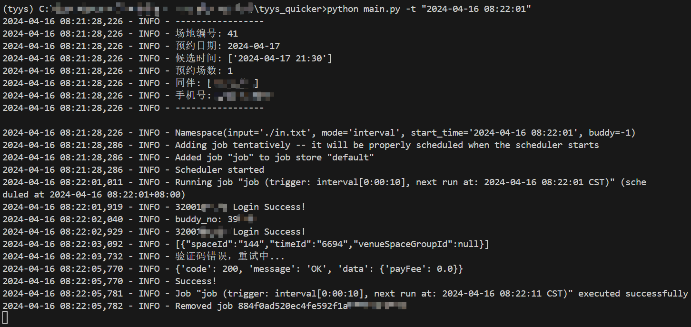
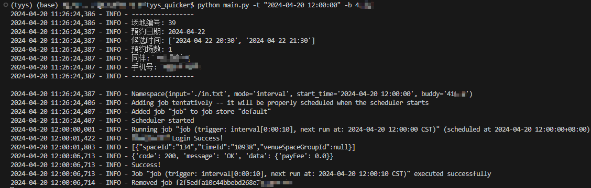

# [原脚本地址](https://github.com/IshiKura-a/Quicker)

# ZJU场馆预约脚本
！！！本项目遵循GPL开源协议

## 执行脚本前需要安装需要的环境和包
安装虚拟环境：
`conda create --name tyys python=3.9.19`

激活虚拟环境：
`conda activate tyys`或`activate tyys`

安装依赖的包：
`pip install -r requirements.txt`

## 在`main.py`所在目录下创建`config.json`，内容为统一身份验证的用户名和密码：
```json
{
  "username": "username",
  "password": "password",
  "buddies": [
    {
      "username": "username",
      "password": "password"
    },
    {
      "username": "username",
      "password": "password"
    }]
}
```
buddies是同伴列表（需要至少和该同伴手动预约过一次），填写同伴的统一身份认证用户名和密码，用来自动获取同伴码。有几个同伴写几个，如果手动输入同伴码，可以不填，buddies列表留空即可：
```json
{
  "username": "username",
  "password": "password",
  "buddies": []
}
```

## 输入的内容为此次脚本的预约内容，并保留在文件中如in.txt
```
39 （场馆编号，各个场馆的编号见 isArt.json 中的id项，可通过Charles等软件抓取。只能填一个，不过会按顺序尝试这个场馆中的所有场地。）
2024-04-06 （预约日期）
14:30 15:30 （预约场次的起始时间。支持多个时间段，按顺序预约直到成功）
1 （连续场数 1/2）
伙伴名称（空格分隔）
电话号码
```
优先遍历时间，只有这个场馆的这个场地的所有时间都被预约时，才会遍历之后的场地。一般对时间有要求，对场地号没要求，所以场次起始时间填一个就可以了。

## 命令行参数
`python main.py -h`获取参数说明。

`-`使用参数缩写，`--`使用参数全称。

完整命令：
`python main.py --input ./in.txt --start_time "2024-04-04 17:15:30" --mode interval --buddy 92277`

如果不填start_time参数，默认立刻执行脚本。

不填buddy参数，默认自动获取。

一般指定时间（如12:00:00开放预约，最好设置脚本运行时间为12:00:01，否则显示还没开放预约。但是我实验室服务器的网络可能有延时，设置12:00:00刚刚好，并且预约成功的概率更高些）、指定同伴码运行：
`python main.py -t "2024-04-04 12:00:01" -b 92277`

## 运行结果
在自动获取同伴码的情况下，目前预约一次需要4秒左右，如果手动输入同伴码，预约速度可以更快（快1秒左右）。


在手动输入同伴码的情况下，并且处于预约高峰期，大概耗时6秒：
